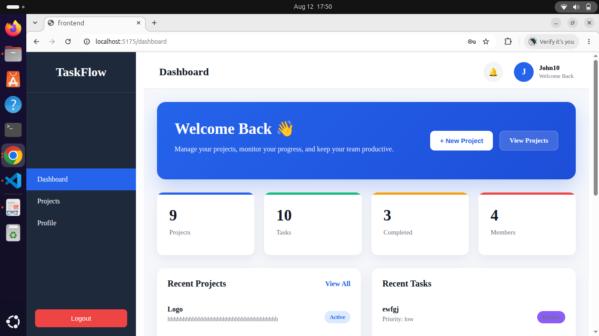
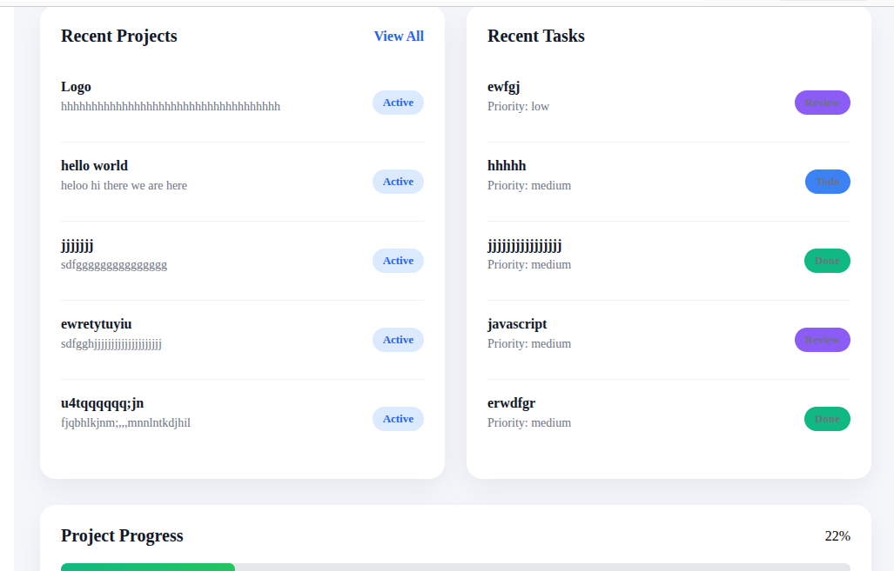
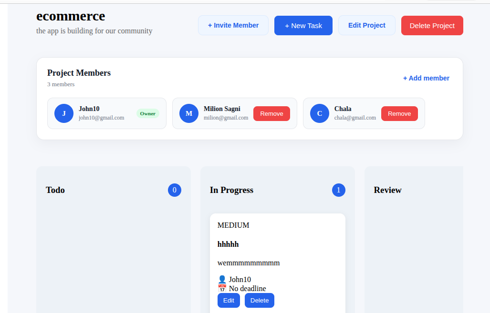
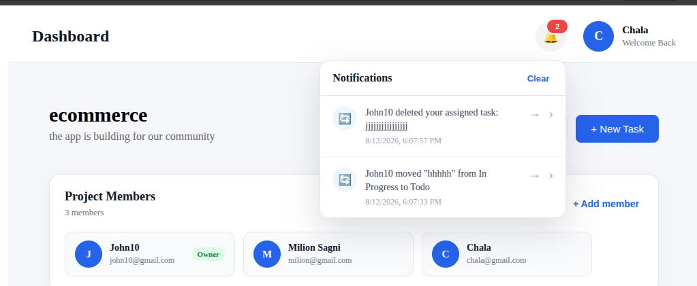
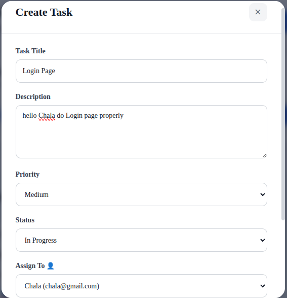
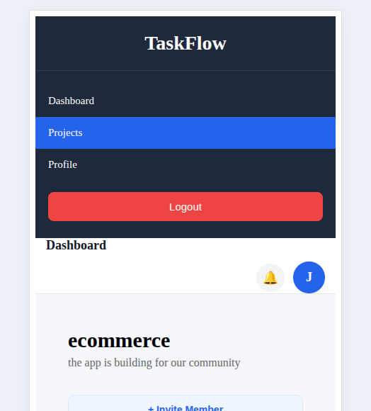

# 🚀 TaskFlow

### Collaborative Project Management Platform

TaskFlow is a full-stack project management application designed to help teams organize projects, manage tasks, collaborate through comments, and receive real-time notifications.

Built with the **MERN stack**, TaskFlow provides a Trello/Asana-inspired workspace with authentication, project management, task assignment, drag-and-drop boards, comments, notifications, and real-time updates.

**🌐 Live Demo:** [TaskFlow](https://taskflow-management-tool.vercel.app/)

---

## 📌 Overview

TaskFlow allows teams to create collaborative workspaces, organize projects, assign tasks to members, track task progress, and communicate directly within tasks.

The application was developed as part of my **CodeAlpha Full Stack Development Internship** to demonstrate practical experience in building and deploying a complete full-stack web application.

### Core workflow

```text
User
 ↓
Authentication
 ↓
Create / Join Project
 ↓
Add Team Members
 ↓
Create Tasks
 ↓
Assign Tasks
 ↓
Track Progress
 ↓
Comment & Collaborate
 ↓
Receive Notifications
```

---

## ✨ Features

### 🔐 Authentication

* User registration and login
* JWT-based authentication
* Protected routes
* Secure password handling
* User profile management
* Password change functionality

### 📁 Project Management

* Create projects
* View project details
* Add and manage project members
* Collaborative project workspaces
* Project-based task organization

### ✅ Task Management

* Create tasks
* Edit tasks
* Delete tasks
* Assign tasks to team members
* Task priorities
* Task descriptions
* Task status tracking
* Drag-and-drop task management

### 📊 Task Board

Tasks can be organized using a visual Kanban-style board:

```text
┌─────────────┐
│    TODO     │
├─────────────┤
│   Tasks     │
│   Tasks     │
└─────────────┘

┌─────────────┐
│ IN PROGRESS │
├─────────────┤
│   Tasks     │
│   Tasks     │
└─────────────┘

┌─────────────┐
│   REVIEW    │
├─────────────┤
│   Tasks     │
└─────────────┘

┌─────────────┐
│    DONE     │
├─────────────┤
│   Tasks     │
└─────────────┘
```

### 💬 Comments & Collaboration

* Add comments to tasks
* Discuss tasks with project members
* View task-related conversations
* Real-time collaboration support

### 🔔 Notifications

* Task assignment notifications
* Project-related notifications
* Comment notifications
* Real-time notification updates
* Notification center

### ⚡ Real-Time Updates

TaskFlow uses **Socket.IO** to provide real-time communication and updates between connected users.

### 📱 Responsive Design

The interface is designed to work across:

* Desktop
* Laptop
* Tablet
* Mobile devices

---

## 🛠️ Tech Stack

### Frontend

* React
* Vite
* JavaScript
* CSS
* Axios
* React Router
* Socket.IO Client
* @hello-pangea/dnd
* React Toastify

### Backend

* Node.js
* Express.js
* MongoDB
* Mongoose
* JWT
* bcrypt
* Socket.IO
* REST API

### Deployment

* Frontend: Vercel
* Backend: Node.js deployment platform
* Database: MongoDB Atlas
* Version Control: Git & GitHub

---

## 📸 Screenshots

### Dashboard



### Project Board



### Task Details & Comments



### Notifications



### Task Management



### Responsive Design



---

## 🏗️ Project Structure

```text
CodeAlpha_ProjectManagement/
│
├── backend/
│   ├── config/
│   ├── controllers/
│   ├── middleware/
│   ├── models/
│   ├── routes/
│   ├── services/
│   ├── sockets/
│   ├── server.js
│   └── package.json
│
├── frontend/
│   ├── public/
│   ├── src/
│   │   ├── components/
│   │   ├── pages/
│   │   ├── services/
│   │   ├── App.jsx
│   │   └── main.jsx
│   ├── package.json
│   └── vite.config.js
│
├── screenshots/
│   ├── dashboard.png
│   ├── project-board.png
│   ├── task-details.png
│   ├── notifications.png
│   ├── task-management.png
│   └── responsive.png
│
├── .gitignore
└── README.md
```

---

## ⚙️ Installation

### 1. Clone the repository

```bash
git clone https://github.com/mi11io0n-5agni/CodeAlpha_ProjectManagement.git
```

### 2. Navigate into the project

```bash
cd CodeAlpha_ProjectManagement
```

---

## 🔧 Backend Setup

Navigate to the backend:

```bash
cd backend
```

Install dependencies:

```bash
npm install
```

Create a `.env` file:

```env
PORT=5000
MONGO_URI=your_mongodb_connection_string
JWT_SECRET=your_jwt_secret
CLIENT_URL=your_frontend_url
```

Start the development server:

```bash
npm run dev
```

The backend will run on:

```text
http://localhost:5000
```

---

## 💻 Frontend Setup

Open another terminal and navigate to the frontend:

```bash
cd frontend
```

Install dependencies:

```bash
npm install
```

Create the required environment configuration:

```env
VITE_API_URL=your_backend_api_url
```

Start the development server:

```bash
npm run dev
```

The frontend will normally be available at:

```text
http://localhost:5173
```

---

## 🔑 Environment Variables

### Backend

| Variable     | Description                    |
| ------------ | ------------------------------ |
| `PORT`       | Backend server port            |
| `MONGO_URI`  | MongoDB connection string      |
| `JWT_SECRET` | Secret used to sign JWT tokens |
| `CLIENT_URL` | Frontend application URL       |

### Frontend

| Variable       | Description     |
| -------------- | --------------- |
| `VITE_API_URL` | Backend API URL |

> Never commit your `.env` files or secret keys to GitHub.

---

## 🔄 Application Architecture

```text
                    ┌────────────────────┐
                    │      React UI      │
                    │      Vite          │
                    └─────────┬──────────┘
                              │
                         REST API
                              │
                    ┌─────────▼──────────┐
                    │     Express.js     │
                    │      Backend       │
                    └──────┬───────┬─────┘
                           │       │
                    ┌──────▼───┐ ┌─▼──────────┐
                    │ MongoDB  │ │ Socket.IO  │
                    │ Database │ │ Real-time  │
                    └──────────┘ └────────────┘
```

---

## 🔐 Security

TaskFlow implements several security mechanisms:

* JWT authentication
* Protected API routes
* Password hashing with bcrypt
* Environment-based configuration
* Authorization checks for protected resources
* Separation between frontend and backend

---

## 🚀 Deployment

The application is deployed as a production-ready full-stack application.

### Frontend

**Vercel**

🌐 [Open TaskFlow](https://taskflow-management-tool.vercel.app/)

### Database

**MongoDB Atlas**

### Backend

The backend is deployed separately and communicates with the frontend through the configured API URL.

---

## 📈 Future Improvements

Possible future improvements include:

* File attachments for tasks
* Advanced project analytics
* Task due-date reminders
* Email notifications
* Team activity timeline
* Search and filtering
* Dark/light theme customization
* Role-based project permissions
* Improved mobile navigation
* Automated testing
* CI/CD pipeline

---

## 🎯 Project Goals

This project was built to demonstrate practical full-stack development skills, including:

* Building RESTful APIs
* Designing MongoDB data models
* Implementing JWT authentication
* Building reusable React components
* Managing application state
* Implementing real-time communication
* Creating responsive user interfaces
* Integrating frontend and backend systems
* Deploying a full-stack application

---

## 🎓 Internship Project

**Program:** CodeAlpha Full Stack Development Internship

**Project:** TaskFlow - Project Management Tool

The project demonstrates the implementation of a complete collaborative project management system using modern web development technologies.

---

## 👨‍💻 Author

### Milion Sagni

Computer Science Student & Full-Stack Developer

Interested in:

* Full-stack web development
* Software engineering
* Linux
* Backend development
* Databases
* System architecture

### GitHub

[github.com/mi11io0n-5agni](https://github.com/mi11io0n-5agni)

---

## ⭐ Support

If you find this project useful or interesting, consider giving the repository a ⭐ on GitHub.

---

## 📄 License

This project is developed for educational and internship purposes.
